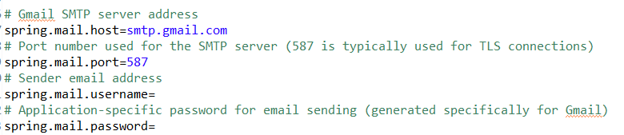
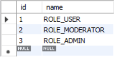

# Spring Boot Security Project

## Technologies Used
- **Java Version:** `17.0.7`
- **Spring Boot Version:** `3.3.2`
- **MySQL Version:** `8.0.40`

This project is configured with the above versions. You can refer to the following recommendations for compatibility with other versions.

## Compatibility Guide

### Java
- **Minimum Required Version:** `Java 17.0.0`
- **Recommended Version:** `Java 17.0.7` and above
- **Not Recommended:** `Java 16` or lower versions may be incompatible with Spring Boot 3.x. While Java 18 and newer versions are supported, they might require additional configuration changes.

### Spring Boot
- **Minimum Required Version:** `Spring Boot 3.3.0`
- **Recommended Version:** `Spring Boot 3.3.2` and above
- **Compatible Versions:** The `Spring Boot 3.3.x` series is fully compatible with the project structure and works well with Spring Boot Security.
- **Not Recommended:** `3.2.x` and below may lack some security features and could be incompatible with the current project setup.

### MySQL
- **Minimum Required Version:** `MySQL 8.0.20`
- **Recommended Version:** `MySQL 8.0.40` and above
- **Compatible Versions:** MySQL versions between `8.0.20` and `8.1.x` are compatible with this project and meet current security standards.
- **Not Recommended:** `MySQL 5.x` and earlier versions may cause issues with some SQL queries and data types used in this project. MySQL `8.2.x` and above might require configuration adjustments not included here.

## Email Configuration

This project uses Gmail's SMTP server for email notifications. To configure email sending in your application, update the following properties in the `application.properties` file:



- **spring.mail.host**: `smtp.gmail.com`
- **spring.mail.port**: `587`
- **spring.mail.username**: Your Gmail email address (e.g., `your-email@gmail.com`)
- **spring.mail.password**: An application-specific password generated from your Google account security settings.

> **Note**: For detailed instructions on setting up an application-specific password for Gmail, you can refer to [this video](https://www.youtube.com/watch?v=3vINS4tzjIw&list=LL&index=2). This video provides step-by-step guidance on enabling two-factor authentication and generating an application-specific password.

#### Daily Email Limits
- **Personal Gmail Accounts**: Gmail has a daily limit of **500 emails**. This limit may affect applications sending a high volume of emails.
- **Corporate Gmail Accounts**: G Suite (Google Workspace) accounts generally have a higher daily email limit, allowing for **up to 2,000 emails** per day, depending on the subscription level.

> **Reminder**: Ensure that you have enabled two-factor authentication in your Google account, as generating an application-specific password requires it.

## Database Configuration

After setting up the project, you need to configure the `roles` table in the database with the following entries:



- `ROLE_USER`
- `ROLE_MODERATOR`
- `ROLE_ADMIN`

You can insert these roles by running the following SQL query:

```sql
INSERT INTO roles (id, name) VALUES
(1, 'ROLE_USER'),
(2, 'ROLE_MODERATOR'),
(3, 'ROLE_ADMIN');
```
This setup is essential for role-based access control within the application. If the roles are missing, certain functionalities may not work as expected.

# Key Features
- **Security:** JWT-based authentication and role-based access control.
- **Endpoint Protection:** @PreAuthorize annotations manage sensitive access at the API level.
- **Token Management:** JWT tokens and user roles are stored in cookies for enhanced security.
- **Code Readability:** Extensive comments are added throughout the code to facilitate understanding and maintainability.

# Contributing
I aimed to make this project as user-friendly and understandable as possible. If you notice any inconsistencies, have suggestions, or want to contribute, please feel free to reach out.

# Contact
For questions, feedback, or contribution requests, contact me at: salih.can@aydogdutech.com
